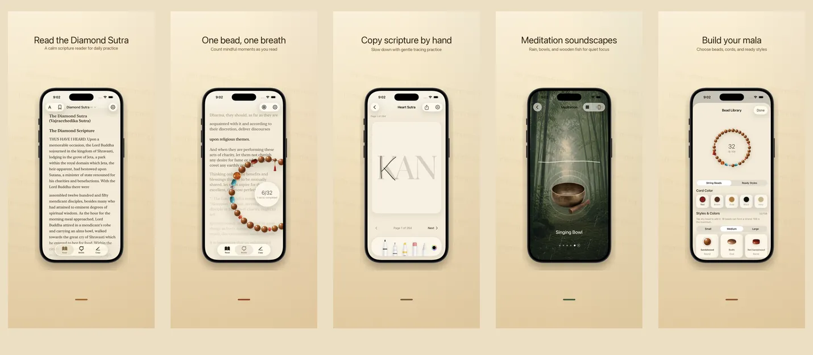

<p align="center">
  
</p>

<h1 align="center">Rushi 如是</h1>

<p align="center">
  <strong>One bead, one breath, one moment</strong>
  <br>
  Diamond Sutra &amp; Heart Sutra · 17 languages · 100% on-device
  <br>
  <a href="https://hooosberg.github.io/Rushi/">🌐 Official Website</a>
</p>

<p align="center">
  <a href="README.md">English</a> |
  <a href="i18n/README_zh-Hans.md">简体中文</a> |
  <a href="i18n/README_zh-Hant.md">繁體中文</a> |
  <a href="i18n/README_ja.md">日本語</a> |
  <a href="i18n/README_ko.md">한국어</a> |
  <a href="i18n/README_vi.md">Tiếng Việt</a> |
  <a href="i18n/README_de.md">Deutsch</a> |
  <a href="i18n/README_fr.md">Français</a> |
  <a href="i18n/README_th.md">ไทย</a>
</p>

<p align="center">
  <a href="LICENSE"></a>
  
  
  <br>
  
  
  
</p>

<p align="center">
  <a href="https://hooosberg.github.io/Rushi/">
    
  </a>
</p>

> 🚧 **App Store: coming soon.** Source scriptures are already public — see `scriptures/` below.

**Rushi (如是)** is a quiet iPhone &amp; iPad app for reading the **Diamond Sutra** and **Heart Sutra**, working a 108-bead mala, copying scripture, and sitting with meditation soundscapes. Everything stays on your device — no account, no analytics, no third-party trackers.

The name **如是** ("Thusness", *tathatā*) is the first phrase of the Diamond Sutra: **如是我闻** — *"Thus have I heard."* It is the stance the app tries to embody: read what is here, count what is here, breathe where you are.

---

## 🌟 Design philosophy

- **Quiet by design** — no streaks, no badges, no nudges. Each feature is shaped around a single complete sitting.
- **Faithful to the source** — every passage carries translator, source edition, date, and copyright provenance. Two Chinese translations (Kumārajīva and Xuanzang) are both included for comparison.
- **Truly local** — no account, no cloud upload, no analytics SDK. The current version stores everything inside the app sandbox; uninstalling the app removes all data.

---

## ✨ Features

- 📖 **Read** — Diamond Sutra (Kumārajīva 5 c. + Xuanzang 7 c. Chinese) and Heart Sutra in calligraphic serif typography. 17 UI languages, 9 sutra translations, every passage annotated.
- 📿 **Mala beads** — Realistic wood, jade, bodhi, and silver beads you can string and finish with a pendant. Tap to count; 108 beads complete one dedication. The current sutra passage scrolls quietly behind the strand.
- 🖋 **Copy practice** — A clean grid-based canvas with stylus and touch support. The original text fades in as a guide; trace one character at a time and save the finished sheet.
- 🎵 **Meditation sounds** — Wooden fish, singing bowl, bell, hand bell, rain, bamboo grove. Each loop is seamless and freely layerable. No network required.
- 🪷 **Dedication & history** — After each completed mala, write a short intention. Stored on-device, sorted by date and sutra, visible only to you.
- 🔒 **On-device only** — No sign-up, no cloud sync to us, no analytics. Apple App Store privacy label: **"Data Not Collected."**

---

## 📜 Open-source scriptures

Every sutra passage shipped with the app comes from a verified public-domain source edition. The cleaned-up Markdown corpus is released here under [**CC0 1.0 Public Domain Dedication**](https://creativecommons.org/publicdomain/zero/1.0/).

| Sutra | Editions | Languages | Folder |
|-------|----------|-----------|--------|
| 心经 · Heart Sutra | 1 short recension | 11 languages | [`scriptures/xin-jing/`](scriptures/xin-jing/) |
| 金刚经 · Diamond Sutra | 13 versions (Kumārajīva + Xuanzang Chinese, Goddard 1932 English, Walleser 1914 German, 9-c Tibetan, 1935 NDL Japanese, 1922 Baek Yongseong Korean, and more) | 13 editions | [`scriptures/jingang-jing/`](scriptures/jingang-jing/) |

Each Markdown file declares, in its YAML front matter:

- translator and dates
- source edition name and URL
- copyright basis (jurisdiction-by-jurisdiction reasoning where relevant)
- editorial status (`final` / `verified` / `ai-cross-reviewed`)
- editorial notes

Use it for research, teaching, comparative reading, or as a starting point for your own app — no attribution required, but appreciated.

---

## 🔒 Privacy at a glance

| | |
|---|---|
| Personal info | None collected |
| Analytics SDKs | None |
| Third-party trackers | None |
| Network requests | None (entire app is offline) |
| Permissions requested | Notifications (only if you opt in to a recitation reminder) |
| Storage | App sandbox only (uninstall removes everything) |
| Apple privacy label | **Data Not Collected** |

Full text: [**Privacy Policy**](https://hooosberg.github.io/Rushi/privacy.html) · [**Terms of Service**](https://hooosberg.github.io/Rushi/terms.html)

---

## 🔤 Bundled fonts

The app bundles a glyph subset of [**Noto Serif CJK SC / TC**](https://github.com/notofonts/noto-cjk) so that Chinese serif renders reliably even on iOS Simulator runtimes that have stripped Songti / PingFang. Font is licensed under the [SIL Open Font License 1.1](https://scripts.sil.org/OFL); the OFL LICENSE file ships inside the app bundle.

---

## 🗂 Repository layout

```
.
├── index.html              landing page (GitHub Pages)
├── privacy.html            privacy policy (English, authoritative)
├── terms.html              terms of service (English, authoritative)
├── i18n.js                 site-side i18n + language picker
├── styles.css              site styles
├── icons/                  app icons (1024 master + 8 sizes)
├── posters/                App Store promo posters in 9 languages
├── scriptures/
│   ├── xin-jing/           Heart Sutra (11 languages, CC0)
│   └── jingang-jing/       Diamond Sutra (13 editions, CC0)
└── i18n/                   translated copies of this README
```

---

## 🛠 Tech notes

The iOS app is built in Swift 5 / SwiftUI on iOS 17 with SwiftData for local storage, CoreText for sutra typography (custom Chinese serif fallback that bypasses the iOS 17 `UIFont(name:)` bug via `CTFontCreateWithName`), and CoreMotion for the gentle pendant-swing physics. The Swift source is not yet open-sourced; this repository contains only the public website and scripture corpus.

---

## 🌐 Sibling projects

Built by [hooosberg](https://github.com/hooosberg):

- [WitNote](https://hooosberg.github.io/WitNote/) — local-first AI writing companion
- [AgentLimb](https://agentlimb.com) — teach AI to control your browser
- [BeRaw](https://hooosberg.github.io/BeRaw/) — Behance raw-image grabber
- [Packpour](https://hooosberg.github.io/Packpour/) — App Store Connect locale filler
- [GlotShot](https://hooosberg.github.io/GlotShot/) — perfect App Store preview images
- [TrekReel](https://hooosberg.github.io/TrekReel/) — outdoor trails, cinematic reels
- [DOMPrompter](https://hooosberg.github.io/DOMPrompter/) — visualize DOM for AI code
- [UIXskills](https://uixskills.com) — AI → JSON → Whiteboard → UI

---

## 👨‍💻 Developer

**hooosberg**

📧 [zikedece@proton.me](mailto:zikedece@proton.me)

🔗 [https://github.com/hooosberg/Rushi](https://github.com/hooosberg/Rushi)

🐛 Found a wrong character or a better source edition? Please open an [issue](https://github.com/hooosberg/Rushi/issues) or PR.

---

<p align="center">
  <i>One bead, one breath, one moment<br>如是我闻</i>
</p>
