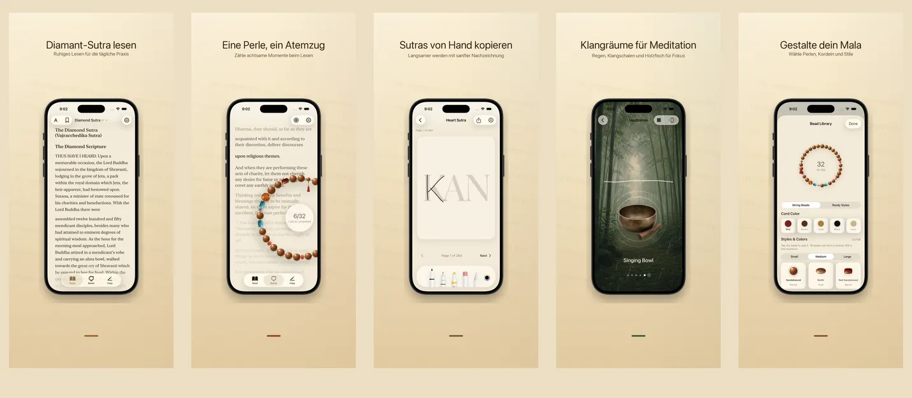

<p align="center">
  
</p>

<h1 align="center">Rushi 如是</h1>

<p align="center">
  <strong>Eine Perle, ein Atemzug, jetzt</strong>
  <br>
  Diamant-Sutra &amp; Herz-Sutra · 17 Sprachen · 100% auf dem Gerät
  <br>
  <a href="https://hooosberg.github.io/Rushi/">🌐 Offizielle Website</a>
</p>

<p align="center">
  <a href="../README.md">English</a> |
  <a href="README_zh-Hans.md">简体中文</a> |
  <a href="README_zh-Hant.md">繁體中文</a> |
  <a href="README_ja.md">日本語</a> |
  <a href="README_ko.md">한국어</a> |
  <a href="README_vi.md">Tiếng Việt</a> |
  <a href="README_de.md">Deutsch</a> |
  <a href="README_fr.md">Français</a> |
  <a href="README_th.md">ไทย</a>
</p>

<p align="center">
  <a href="../LICENSE"></a>
  
  
  <br>
  
  
  
</p>

<p align="center">
  <a href="https://hooosberg.github.io/Rushi/">
    
  </a>
</p>

> 🚧 **App Store: bald.** Die Quelltexte sind bereits öffentlich — siehe `scriptures/`.

**Rushi (如是)** ist eine ruhige iPhone- und iPad-App zum Lesen des **Diamant-Sutra** und **Herz-Sutra**, mit 108er-Mala, Schreibpraxis und Meditationsklängen. Alles bleibt auf deinem Gerät — kein Konto, kein Tracking, keine Drittanbieter.

Der Name **如是** ("Soheit", *tathatā*) ist die Eröffnungsphrase des Diamant-Sutra: **如是我聞** — *"Also habe ich gehört."* Es ist die Haltung, die die App zu verkörpern versucht: lies, was hier ist; zähle, was hier ist; atme, wo du bist.

---

## 🌟 Designphilosophie

- **Leise gestaltet** — keine Streaks, keine Abzeichen, keine Erinnerungen. Jede Funktion ist auf eine einzige vollständige Sitzung ausgelegt.
- **Quellentreu** — jeder Abschnitt nennt Übersetzer, Quellausgabe, Datum und Urheberrechtsbasis. Beide chinesischen Diamant-Sutra-Übersetzungen (Kumārajīva und Xuanzang) sind enthalten.
- **Wirklich lokal** — kein Konto, keine Cloud bei uns, keine Analytik. Optionale iCloud-Synchronisation nutzt deine private CloudKit-Datenbank, end-zu-end von Apple verschlüsselt.

---

## ✨ Funktionen

- 📖 **Lesen** — Diamant-Sutra (Kumārajīva 5. Jh. + Xuanzang 7. Jh. chinesisch) und Herz-Sutra in serifierter Schreibtypografie. 17 UI-Sprachen, 9 Sutra-Übersetzungen, jeder Abschnitt belegt.
- 📿 **Mala-Perlen** — Realistische Holz-, Jade-, Bodhi- und Silberperlen, frei zu einer Mala kombinierbar mit Anhänger. Tippen zum Zählen; 108 Perlen ergeben eine Widmung. Im Hintergrund läuft der gerade gelesene Text leise mit.
- 🖋 **Schreibpraxis** — Klare Raster-Schreibfläche mit Stylus- und Touch-Unterstützung. Der Originaltext erscheint blass; pause Zeichen für Zeichen nach und sichere das fertige Blatt.
- 🎵 **Meditationsklänge** — Holzfisch, Klangschale, Glocke, Glöckchen, Regen, Bambushain. Jede Schleife nahtlos, frei zu schichten. Ohne Netz.
- 🪷 **Widmung & Verlauf** — Nach jeder vollen Mala eine kurze Widmung schreiben. Lokal gespeichert, nach Datum und Sutra geordnet, nur für dich sichtbar.
- 🔒 **Geräteintern** — Keine Anmeldung, kein Cloud-Upload zu uns, keine Analytik. Apple-App-Store-Datenschutzlabel: **"Data Not Collected"**.

---

## 📜 Open-Source-Sutren

Jeder Sutra-Abschnitt der App stammt aus einer geprüften gemeinfreien Quellausgabe. Der gereinigte Markdown-Korpus wird hier unter [**CC0 1.0 Public Domain**](https://creativecommons.org/publicdomain/zero/1.0/) veröffentlicht.

| Sutra | Ausgaben | Sprachen | Verzeichnis |
|-------|----------|----------|-------------|
| Herz-Sutra · 心经 | 1 Kurzfassung | 11 Sprachen | [`scriptures/xin-jing/`](../scriptures/xin-jing/) |
| Diamant-Sutra · 金刚经 | 13 Fassungen (Kumārajīva + Xuanzang chinesisch, Goddard 1932 englisch, Walleser 1914 deutsch, 9.-Jh. tibetisch, 1935 NDL japanisch, 1922 Baek Yongseong koreanisch, …) | 13 Fassungen | [`scriptures/jingang-jing/`](../scriptures/jingang-jing/) |

Jede Markdown-Datei nennt im YAML-Kopf:

- Übersetzer und Daten
- Quellausgabe-Name und URL
- Urheberrechtsbasis (rechtsraumweise begründet, falls relevant)
- Redaktionsstand (`final` / `verified` / `ai-cross-reviewed`)
- Redaktionelle Anmerkungen

Nutzbar für Forschung, Lehre, vergleichende Lektüre oder als Ausgangspunkt für deine eigene App — keine Namensnennung erforderlich, aber willkommen.

---

## 🔒 Datenschutz auf einen Blick

| | |
|---|---|
| Personenbezogene Daten | Keine erhoben |
| Analytics-SDKs | Keine |
| Drittanbieter-Tracker | Keine |
| Netzwerkanfragen | Keine (gesamte App offline) |
| Berechtigungen | Benachrichtigungen (nur wenn du eine Rezitations-Erinnerung aktivierst) |
| Speicherung | App-Sandbox + deine private iCloud (optional) |
| Apple-Datenschutzlabel | **Data Not Collected** |

Volltext: [**Privacy Policy**](https://hooosberg.github.io/Rushi/privacy.html) · [**Terms of Service**](https://hooosberg.github.io/Rushi/terms.html)

---

## 🔤 Mitgelieferte Schriften

Die App enthält ein Glyph-Subset von [**Noto Serif CJK SC / TC**](https://github.com/notofonts/noto-cjk), damit chinesische Serifenschrift zuverlässig auch auf iOS-Simulatoren ohne Songti / PingFang gerendert wird. Lizenz: [SIL OFL 1.1](https://scripts.sil.org/OFL); die OFL-LICENSE-Datei wird im App-Bundle ausgeliefert.

---

## 🗂 Repository-Struktur

```
.
├── index.html              Landingpage (GitHub Pages)
├── privacy.html            Datenschutz (englisch, maßgeblich)
├── terms.html              Nutzungsbedingungen (englisch, maßgeblich)
├── i18n.js                 Site-i18n + Sprachauswahl
├── styles.css              Site-Stil
├── icons/                  App-Icons (1024-Master + 8 Größen)
├── posters/                App-Store-Poster in 9 Sprachen
├── scriptures/
│   ├── xin-jing/           Herz-Sutra (11 Sprachen, CC0)
│   └── jingang-jing/       Diamant-Sutra (13 Fassungen, CC0)
└── i18n/                   Übersetzungen dieses READMEs
```

---

## 🛠 Technische Notizen

Die iOS-App ist in Swift 5 / SwiftUI auf iOS 17 gebaut. Lokale Speicherung mit SwiftData; Sutra-Typografie über CoreText (mit eigener chinesischer Serif-Fallback-Logik, die den iOS-17-Bug von `UIFont(name:)` über `CTFontCreateWithName` umgeht); CoreMotion für die sanfte Anhänger-Schwingphysik; CloudKit für die optionale private iCloud-Synchronisation. Der Swift-Quellcode ist noch nicht Open-Source; dieses Repository enthält nur die öffentliche Website und den Sutra-Korpus.

---

## 🌐 Verwandte Projekte

Von [hooosberg](https://github.com/hooosberg):

- [WitNote](https://hooosberg.github.io/WitNote/) — local-first AI Schreibpartner
- [AgentLimb](https://agentlimb.com) — bringe KI bei, deinen Browser zu steuern
- [BeRaw](https://hooosberg.github.io/BeRaw/) — Behance-Originalbild-Grabber
- [Packpour](https://hooosberg.github.io/Packpour/) — App Store Connect Sprachfüller
- [GlotShot](https://hooosberg.github.io/GlotShot/) — perfekte App-Store-Vorschauen
- [TrekReel](https://hooosberg.github.io/TrekReel/) — Outdoor-Trails als Kino-Reels
- [DOMPrompter](https://hooosberg.github.io/DOMPrompter/) — DOM für AI-Code visualisieren
- [UIXskills](https://uixskills.com) — AI → JSON → Whiteboard → UI

---

## 👨‍💻 Entwickler

**hooosberg**

📧 [zikedece@proton.me](mailto:zikedece@proton.me)

🔗 [https://github.com/hooosberg/Rushi](https://github.com/hooosberg/Rushi)

🐛 Tippfehler entdeckt oder eine bessere Quellausgabe gefunden? Bitte ein [Issue](https://github.com/hooosberg/Rushi/issues) öffnen oder PR.

---

<p align="center">
  <i>Eine Perle, ein Atemzug, jetzt<br>如是我聞</i>
</p>
