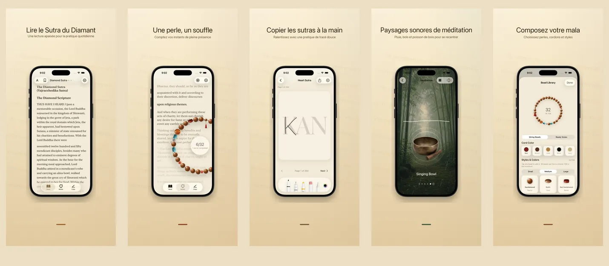

<p align="center">
  
</p>

<h1 align="center">Rushi 如是</h1>

<p align="center">
  <strong>Une perle, un souffle, ici</strong>
  <br>
  Sutra du Diamant &amp; Sutra du Cœur · 17 langues · 100% sur l’appareil
  <br>
  <a href="https://hooosberg.github.io/Rushi/">🌐 Site officiel</a>
</p>

<p align="center">
  <a href="../README.md">English</a> |
  <a href="README_zh-Hans.md">简体中文</a> |
  <a href="README_zh-Hant.md">繁體中文</a> |
  <a href="README_ja.md">日本語</a> |
  <a href="README_ko.md">한국어</a> |
  <a href="README_vi.md">Tiếng Việt</a> |
  <a href="README_de.md">Deutsch</a> |
  <a href="README_fr.md">Français</a> |
  <a href="README_th.md">ไทย</a>
</p>

<p align="center">
  <a href="../LICENSE"></a>
  
  
  <br>
  
  
  
</p>

<p align="center">
  <a href="https://hooosberg.github.io/Rushi/">
    
  </a>
</p>

> 🚧 **App Store : bientôt.** Les textes sources sont déjà publics — voir `scriptures/`.

**Rushi (如是)** est une appli iPhone et iPad calme pour lire le **Sutra du Diamant** et le **Sutra du Cœur**, manier un mâlâ de 108 perles, recopier les sutras et s’asseoir avec des paysages sonores méditatifs. Tout reste sur votre appareil — pas de compte, pas d’analytique, pas de pisteur tiers.

Le nom **如是** ("Telleté", *tathatā*) ouvre le Sutra du Diamant : **如是我聞** — *"Ainsi ai-je entendu."* C’est la posture que l’app cherche à incarner : lire ce qui est là, compter ce qui est là, respirer là où l’on est.

---

## 🌟 Philosophie de conception

- **Conçue pour le silence** — pas de séries, pas de badges, pas de relances. Chaque fonction est pensée pour une seule séance complète.
- **Fidèle à la source** — chaque passage indique traducteur, édition source, date et base juridique. Les deux traductions chinoises du Sutra du Diamant (Kumārajīva et Xuanzang) sont incluses.
- **Vraiment locale** — pas de compte, pas de cloud, pas d’analytique. La version actuelle stocke tout dans la sandbox de l’app ; désinstaller supprime toutes les données.

---

## ✨ Fonctions

- 📖 **Lecture** — Sutra du Diamant (deux traductions chinoises, Kumārajīva 5e s. + Xuanzang 7e s.) et Sutra du Cœur en typographie sérif calligraphique. 17 langues d’interface, 9 traductions de sutras, chaque passage attesté.
- 📿 **Mâlâ** — Perles de bois, jade, bodhi et argent au rendu réaliste, à enfiler librement avec un pendentif. Toucher pour compter ; 108 perles pour une dédicace. Le passage en cours défile en arrière-plan.
- 🖋 **Recopie** — Une grille calligraphique épurée avec stylet et tactile. Le texte d’origine apparaît en filigrane ; tracez caractère par caractère, puis enregistrez la feuille terminée.
- 🎵 **Sons de méditation** — Poisson de bois, bol chantant, cloche, clochettes, pluie, bambouseraie. Chaque boucle s’enchaîne sans rupture, et se superpose à volonté. Sans réseau.
- 🪷 **Dédicace · historique** — Après chaque mâlâ complet, écrivez une courte intention. Conservé sur l’appareil, classé par date et sutra, visible par vous seul.
- 🔒 **En local uniquement** — Pas d’inscription, pas de cloud chez nous, pas d’analytique. Étiquette App Store : **"Data Not Collected"**.

---

## 📜 Sutras open source

Chaque passage de l’app provient d’une édition source vérifiée du domaine public. Le corpus Markdown nettoyé est publié ici sous [**CC0 1.0 Domaine public**](https://creativecommons.org/publicdomain/zero/1.0/).

| Sutra | Versions | Langues | Dossier |
|-------|----------|---------|---------|
| Sutra du Cœur · 心经 | 1 court recension | 11 langues | [`scriptures/xin-jing/`](../scriptures/xin-jing/) |
| Sutra du Diamant · 金刚经 | 13 versions (Kumārajīva + Xuanzang en chinois, Goddard 1932 anglais, Walleser 1914 allemand, traduction tibétaine 9e s., NDL 1935 japonais, 백용성 1922 coréen, …) | 13 versions | [`scriptures/jingang-jing/`](../scriptures/jingang-jing/) |

Chaque fichier Markdown indique en en-tête YAML :

- traducteur et dates
- nom de l’édition source et URL
- base juridique du domaine public (avec raisonnement par juridiction si besoin)
- statut éditorial (`final` / `verified` / `ai-cross-reviewed`)
- notes éditoriales

À utiliser pour la recherche, l’enseignement, la lecture comparée, ou comme socle pour votre propre app — aucune attribution requise (mais bienvenue).

---

## 🔒 Confidentialité en un coup d’œil

| | |
|---|---|
| Données personnelles | Aucune collectée |
| SDK d’analytique | Aucun |
| Pisteurs tiers | Aucun |
| Requêtes réseau | Aucune (app entièrement hors ligne) |
| Permissions demandées | Notifications (uniquement si vous activez un rappel de récitation) |
| Stockage | Sandbox de l’app uniquement (désinstaller supprime tout) |
| Étiquette Apple | **Data Not Collected** |

Texte complet : [**Privacy Policy**](https://hooosberg.github.io/Rushi/privacy.html) · [**Terms of Service**](https://hooosberg.github.io/Rushi/terms.html)

---

## 🔤 Polices intégrées

L’app embarque un sous-ensemble de glyphes de [**Noto Serif CJK SC / TC**](https://github.com/notofonts/noto-cjk) afin que les sérifs chinois s’affichent correctement, même sur les simulateurs iOS où Songti / PingFang ont été retirés. Sous licence [SIL OFL 1.1](https://scripts.sil.org/OFL) ; le fichier OFL LICENSE est livré dans le bundle de l’app.

---

## 🗂 Structure du dépôt

```
.
├── index.html              page d’atterrissage (GitHub Pages)
├── privacy.html            politique de confidentialité (anglais, version faisant foi)
├── terms.html              conditions d’utilisation (anglais, version faisant foi)
├── i18n.js                 i18n du site + sélecteur de langue
├── styles.css              styles du site
├── icons/                  icônes de l’app (1024 maître + 8 tailles)
├── posters/                visuels App Store en 9 langues
├── scriptures/
│   ├── xin-jing/           Sutra du Cœur (11 langues, CC0)
│   └── jingang-jing/       Sutra du Diamant (13 versions, CC0)
└── i18n/                   traductions de ce README
```

---

## 🛠 Notes techniques

L’app iOS est construite en Swift 5 / SwiftUI sur iOS 17. Stockage local via SwiftData ; typographie des sutras via CoreText (avec un repli sérif chinois maison qui contourne le bug d’iOS 17 sur `UIFont(name:)` via `CTFontCreateWithName`) ; CoreMotion pour la physique douce du pendentif. Le code source Swift n’est pas encore open source ; ce dépôt ne contient que le site public et le corpus des sutras.

---

## 🌐 Projets frères

Par [hooosberg](https://github.com/hooosberg) :

- [WitNote](https://hooosberg.github.io/WitNote/) — compagnon d’écriture IA local-first
- [AgentLimb](https://agentlimb.com) — apprenez à l’IA à piloter votre navigateur
- [BeRaw](https://hooosberg.github.io/BeRaw/) — extracteur d’images sources Behance
- [Packpour](https://hooosberg.github.io/Packpour/) — remplissage multilingue App Store Connect
- [GlotShot](https://hooosberg.github.io/GlotShot/) — visuels App Store parfaits
- [TrekReel](https://hooosberg.github.io/TrekReel/) — sentiers en plein air, montages cinéma
- [DOMPrompter](https://hooosberg.github.io/DOMPrompter/) — visualiser le DOM pour code IA
- [UIXskills](https://uixskills.com) — IA → JSON → tableau → UI

---

## 👨‍💻 Développeur

**hooosberg**

📧 [zikedece@proton.me](mailto:zikedece@proton.me)

🔗 [https://github.com/hooosberg/Rushi](https://github.com/hooosberg/Rushi)

🐛 Une coquille ou une meilleure édition source ? Ouvrez une [issue](https://github.com/hooosberg/Rushi/issues) ou un PR.

---

<p align="center">
  <i>Une perle, un souffle, ici<br>如是我聞</i>
</p>
