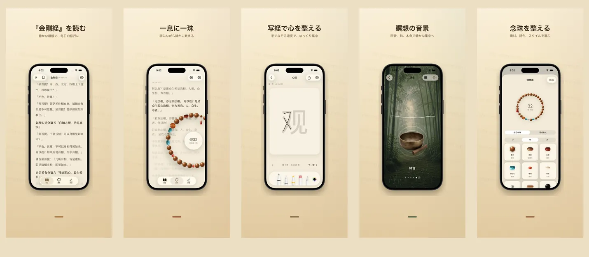

<p align="center">
  
</p>

<h1 align="center">如是 Rushi</h1>

<p align="center">
  <strong>一念一珠、いまここに</strong>
  <br>
  金剛経 &amp; 般若心経 · 17 言語 · 100% 端末ローカル
  <br>
  <a href="https://hooosberg.github.io/Rushi/">🌐 公式ウェブサイト</a>
</p>

<p align="center">
  <a href="../README.md">English</a> |
  <a href="README_zh-Hans.md">简体中文</a> |
  <a href="README_zh-Hant.md">繁體中文</a> |
  <a href="README_ja.md">日本語</a> |
  <a href="README_ko.md">한국어</a> |
  <a href="README_vi.md">Tiếng Việt</a> |
  <a href="README_de.md">Deutsch</a> |
  <a href="README_fr.md">Français</a> |
  <a href="README_th.md">ไทย</a>
</p>

<p align="center">
  <a href="../LICENSE"></a>
  
  
  <br>
  
  
  
</p>

<p align="center">
  <a href="https://hooosberg.github.io/Rushi/">
    
  </a>
</p>

> 🚧 **App Store 近日公開。** 原典は既に `scriptures/` ディレクトリで公開しています。

**如是（Rushi）** は iPhone と iPad の静かな修行アプリ。金剛経と般若心経の多言語読誦、108 珠の念珠、写経パネル、瞑想音景。すべての内容はあなたの端末に保存されます——アカウント不要、解析なし、第三者追跡なし。

アプリ名 **如是**（*tathatā*、「あるがまま」）は『金剛経』冒頭の **如是我聞** から。アプリが体現したい姿勢でもあります：目の前の文字を読み、手の中の珠を数え、いまここで呼吸する。

---

## 🌟 設計思想

- **静かな設計** —— 連続記録もバッジも通知の催促もありません。すべての機能は「一度の完結した修行」のために設計されています。
- **底本に忠実** —— 各段に訳者・底本年代・出典・版権根拠を明記。金剛経は鳩摩羅什と玄奘の二訳を併録、対照読みが可能。
- **真にローカル** —— アカウント不要、クラウド送信なし、解析 SDK なし。任意の iCloud 同期はあなた自身の CloudKit プライベートデータベースを使い、Apple のエンドツーエンド暗号化で保護されます。

---

## ✨ 機能

- 📖 **読経** —— 金剛経（鳩摩羅什 5 世紀 + 玄奘 7 世紀の二訳）と般若心経を、書道セリフ組版で。17 UI 言語・9 経典訳、各段に完全な出典付き。
- 📿 **念珠** —— 本物の質感の木珠 / 翡翠 / 菩提樹 / 銀飾を自由に組み合わせて挂飾を結べます。タップで数え、108 珠で一回向。背景に現在の経文段が静かに流れます。
- 🖋 **写経** —— 一字一格の清浄な写経パネル。スタイラスとタッチ操作対応。原文を薄文字でなぞり、完成した一葉を保存できます。
- 🎵 **瞑想音景** —— 木魚・磬・鐘・鈴・雨音・竹林。各音景はループしてつなぎ目なく、自由に重ねられます。ネット不要。
- 🪷 **回向 · 履歴** —— 一回の念珠を結えるたび、その時の意図を回向として記せます。端末内に保存され、日付と経典別に整理。あなただけが見られます。
- 🔒 **完全ローカル** —— 登録不要・クラウド送信なし・解析なし。Apple App Store プライバシーラベル：**「Data Not Collected」**。

---

## 📜 オープンソース経典

アプリ内のすべての経文は、確かなパブリックドメイン底本から取られています。整理済みの Markdown コーパスは [**CC0 1.0 パブリックドメイン**](https://creativecommons.org/publicdomain/zero/1.0/) で公開しています。

| 経典 | 版数 | 言語 | フォルダ |
|------|------|------|----------|
| 般若心経 · Heart Sutra | 短本 1 | 11 言語 | [`scriptures/xin-jing/`](../scriptures/xin-jing/) |
| 金剛経 · Diamond Sutra | 13 版（鳩摩羅什+玄奘漢訳、Goddard 1932 英訳、Walleser 1914 独訳、9 世紀チベット訳、1935 NDL 日訳、1922 백용성 韓訳など）| 13 版 | [`scriptures/jingang-jing/`](../scriptures/jingang-jing/) |

各 Markdown ファイルの YAML 冒頭には：

- 訳者と年代
- 底本名と出典 URL
- 版権根拠（必要に応じて法域別に）
- 編集状態（`final` / `verified` / `ai-cross-reviewed`）
- 編集ノート

研究・教育・対照読み、または自分のアプリの土台として——表示は不要ですが歓迎します。

---

## 🔒 プライバシー一覧

| | |
|---|---|
| 個人情報 | 収集なし |
| 解析 SDK | なし |
| 第三者追跡 | なし |
| ネットワーク要求 | なし（アプリ全体オフライン） |
| 権限要求 | 通知（読誦リマインダーを有効にした場合のみ） |
| データ保存 | アプリサンドボックス + あなたの iCloud プライベート（任意） |
| Apple プライバシーラベル | **Data Not Collected** |

全文：[**Privacy Policy**](https://hooosberg.github.io/Rushi/privacy.html) · [**Terms of Service**](https://hooosberg.github.io/Rushi/terms.html)

---

## 🔤 同梱フォント

アプリは [**Noto Serif CJK SC / TC**](https://github.com/notofonts/noto-cjk) のグリフサブセットを同梱しています。Songti / PingFang を含まない iOS シミュレータでも漢字セリフが正しく表示されるためです。フォントは [SIL OFL 1.1](https://scripts.sil.org/OFL) ライセンス、OFL LICENSE ファイルはアプリバンドル内に同梱されています。

---

## 🗂 リポジトリ構成

```
.
├── index.html              ランディングページ（GitHub Pages）
├── privacy.html            プライバシーポリシー（英語、正本）
├── terms.html              利用規約（英語、正本）
├── i18n.js                 サイト i18n + 言語切替
├── styles.css              サイトスタイル
├── icons/                  アプリアイコン（1024 マスター + 8 サイズ）
├── posters/                9 言語の App Store プロモーション画像
├── scriptures/
│   ├── xin-jing/           般若心経（11 言語、CC0）
│   └── jingang-jing/       金剛経（13 版、CC0）
└── i18n/                   この README の翻訳版
```

---

## 🛠 技術ノート

iOS アプリは Swift 5 / SwiftUI、iOS 17 で構築。ローカル保存に SwiftData、経文組版に CoreText（iOS 17 の `UIFont(name:)` バグを回避する独自の中華セリフフォールバック、`CTFontCreateWithName` 経由）、挂飾の揺れ感に CoreMotion、任意のプライベート iCloud 同期に CloudKit を使用。Swift ソースコードはまだオープンソース化されていません。本リポジトリは公開ウェブサイトと経典コーパスのみを含みます。

---

## 🌐 関連プロジェクト

[hooosberg](https://github.com/hooosberg) 製：

- [WitNote](https://hooosberg.github.io/WitNote/) —— ローカル優先の AI ライティング相棒
- [AgentLimb](https://agentlimb.com) —— AI にブラウザ操作を教える
- [BeRaw](https://hooosberg.github.io/BeRaw/) —— Behance 原画像取得
- [Packpour](https://hooosberg.github.io/Packpour/) —— App Store Connect 多言語一括入力
- [GlotShot](https://hooosberg.github.io/GlotShot/) —— 完璧な App Store プレビュー画像
- [TrekReel](https://hooosberg.github.io/TrekReel/) —— アウトドア・トレイル映像短編
- [DOMPrompter](https://hooosberg.github.io/DOMPrompter/) —— DOM を可視化して AI コードを支援
- [UIXskills](https://uixskills.com) —— AI → JSON → ホワイトボード → UI

---

## 👨‍💻 開発者

**hooosberg**

📧 [zikedece@proton.me](mailto:zikedece@proton.me)

🔗 [https://github.com/hooosberg/Rushi](https://github.com/hooosberg/Rushi)

🐛 誤字や、より良い底本を見つけたら？[issue](https://github.com/hooosberg/Rushi/issues) や PR を歓迎します。

---

<p align="center">
  <i>一念一珠、いまここに<br>如是我聞</i>
</p>
