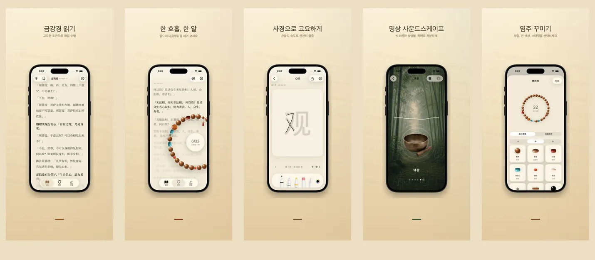

<p align="center">
  
</p>

<h1 align="center">如是 Rushi</h1>

<p align="center">
  <strong>한 염주, 한 호흡, 지금 여기</strong>
  <br>
  금강경 &amp; 반야심경 · 17 개 언어 · 100% 기기 내 저장
  <br>
  <a href="https://hooosberg.github.io/Rushi/">🌐 공식 웹사이트</a>
</p>

<p align="center">
  <a href="../README.md">English</a> |
  <a href="README_zh-Hans.md">简体中文</a> |
  <a href="README_zh-Hant.md">繁體中文</a> |
  <a href="README_ja.md">日本語</a> |
  <a href="README_ko.md">한국어</a> |
  <a href="README_vi.md">Tiếng Việt</a> |
  <a href="README_de.md">Deutsch</a> |
  <a href="README_fr.md">Français</a> |
  <a href="README_th.md">ไทย</a>
</p>

<p align="center">
  <a href="../LICENSE"></a>
  
  
  <br>
  
  
  
</p>

<p align="center">
  <a href="https://hooosberg.github.io/Rushi/">
    
  </a>
</p>

> 🚧 **App Store 곧 출시.** 원전은 이미 `scriptures/` 디렉터리에 공개되어 있습니다.

**如是（Rushi）** 는 iPhone 과 iPad 의 청정한 수행 앱입니다. 금강경과 반야심경의 다국어 독송, 108 알 염주, 사경 패널, 명상 음경. 모든 데이터는 기기 안에만 저장됩니다 — 계정 없음, 분석 없음, 제삼자 추적 없음.

앱 이름 **如是**（*tathatā*, "있는 그대로")는 『금강경』 첫머리 **如是我聞**에서 따왔습니다. 앱이 구현하고자 하는 자세이기도 합니다 — 눈앞의 글을 읽고, 손안의 염주를 헤아리며, 지금 여기서 호흡합니다.

---

## 🌟 디자인 철학

- **고요한 디자인** — 연속 기록 없음, 배지 없음, 알림 재촉 없음. 모든 기능은 「온전한 한 번의 수행」을 위해 설계되었습니다.
- **저본에 충실** — 각 단락에 역자 · 저본 연대 · 출처 · 저작권 근거 명기. 금강경은 구마라집과 현장 두 한역을 함께 수록하여 대조 가능.
- **진짜 로컬** — 계정 없음, 클라우드 업로드 없음, 분석 SDK 없음. 선택적 iCloud 동기화는 본인의 비공개 CloudKit 데이터베이스를 사용하며 Apple 의 종단간 암호화로 보호됩니다.

---

## ✨ 기능

- 📖 **독경** — 금강경 (구마라집 5 세기 + 현장 7 세기 두 한역) 과 반야심경을 서예 세리프 조판으로. 17 UI 언어, 9 종 경전 번역, 각 단락마다 완전한 출처 표기.
- 📿 **염주** — 실제 질감의 목주 / 옥주 / 보리수 / 은장식을 자유롭게 꿰어 매듭과 매달이를 결합. 탭으로 헤아리고 108 알이 한 회향. 배경에는 현재 읽고 있는 경문 단락이 조용히 흐릅니다.
- 🖋 **사경** — 한 글자씩 나눠진 청정한 사경 패널. 스타일러스와 터치 입력 지원. 원문이 흐린 글씨로 안내되어 한 자씩 따라 쓰고 완성된 한 장을 저장할 수 있습니다.
- 🎵 **명상 음경** — 목어 · 경 · 종 · 방울 · 비 · 대숲. 각 음경은 끊김 없이 순환하고 자유롭게 겹칠 수 있습니다. 인터넷 불필요.
- 🪷 **회향 · 기록** — 한 회 염주를 마칠 때마다 그 순간의 회향 의도를 적을 수 있습니다. 기기 안에 저장되어 날짜와 경전별로 정리되며 오직 본인에게만 보입니다.
- 🔒 **완전 로컬** — 회원 가입 없음, 클라우드 없음, 분석 없음. Apple App Store 개인정보 라벨: **「Data Not Collected」**.

---

## 📜 오픈 소스 경전

앱의 모든 경문은 검증된 공공 영역 저본에서 가져왔습니다. 정리된 Markdown 코퍼스는 [**CC0 1.0 공공 영역**](https://creativecommons.org/publicdomain/zero/1.0/) 라이선스로 여기에 공개합니다.

| 경전 | 판본 | 언어 | 폴더 |
|------|------|------|------|
| 반야심경 · Heart Sutra | 단본 1 | 11 개 언어 | [`scriptures/xin-jing/`](../scriptures/xin-jing/) |
| 금강경 · Diamond Sutra | 13 판 (구마라집+현장 한역, Goddard 1932 영역, Walleser 1914 독역, 9 세기 티베트역, 1935 NDL 일역, 1922 백용성 한역 등) | 13 판 | [`scriptures/jingang-jing/`](../scriptures/jingang-jing/) |

각 Markdown 파일의 YAML 머리에 표기:

- 역자와 연대
- 저본 명칭과 출처 URL
- 저작권 근거 (필요시 관할권별로)
- 편집 상태 (`final` / `verified` / `ai-cross-reviewed`)
- 편집 노트

연구 · 교육 · 대조 독서, 또는 직접 만드는 앱의 기반으로 — 표기는 필요없지만 환영합니다.

---

## 🔒 개인정보 한눈에

| | |
|---|---|
| 개인정보 | 수집 없음 |
| 분석 SDK | 없음 |
| 제삼자 추적 | 없음 |
| 네트워크 요청 | 없음 (전체 앱 오프라인) |
| 권한 요청 | 알림 (독송 알림 활성화 시에만) |
| 데이터 저장 | 앱 샌드박스 + 본인의 비공개 iCloud (선택) |
| Apple 개인정보 라벨 | **Data Not Collected** |

전체 텍스트: [**Privacy Policy**](https://hooosberg.github.io/Rushi/privacy.html) · [**Terms of Service**](https://hooosberg.github.io/Rushi/terms.html)

---

## 🔤 번들 폰트

앱은 [**Noto Serif CJK SC / TC**](https://github.com/notofonts/noto-cjk) 글리프 서브셋을 번들합니다. Songti / PingFang 이 빠진 iOS 시뮬레이터에서도 한자 세리프가 안정적으로 렌더링되도록 합니다. 폰트는 [SIL OFL 1.1](https://scripts.sil.org/OFL) 라이선스이며 OFL LICENSE 파일은 앱 번들 안에 함께 배포됩니다.

---

## 🗂 저장소 구조

```
.
├── index.html              랜딩 페이지 (GitHub Pages)
├── privacy.html            개인정보 처리방침 (영어, 권위 버전)
├── terms.html              서비스 약관 (영어, 권위 버전)
├── i18n.js                 사이트 i18n + 언어 선택
├── styles.css              사이트 스타일
├── icons/                  앱 아이콘 (1024 마스터 + 8 사이즈)
├── posters/                9 개 언어의 App Store 프로모 이미지
├── scriptures/
│   ├── xin-jing/           반야심경 (11 개 언어, CC0)
│   └── jingang-jing/       금강경 (13 판, CC0)
└── i18n/                   이 README 의 번역본
```

---

## 🛠 기술 노트

iOS 앱은 Swift 5 / SwiftUI, iOS 17 위에서 빌드. 로컬 저장은 SwiftData; 경문 조판은 CoreText (iOS 17 의 `UIFont(name:)` 버그를 우회하는 자체 중국어 세리프 폴백, `CTFontCreateWithName` 경유); 매달이 흔들림 감각은 CoreMotion; 선택적 비공개 iCloud 동기화는 CloudKit. Swift 소스 코드는 아직 오픈소스화되지 않았습니다. 본 저장소는 공개 웹사이트와 경전 코퍼스만 포함합니다.

---

## 🌐 관련 프로젝트

[hooosberg](https://github.com/hooosberg) 작품:

- [WitNote](https://hooosberg.github.io/WitNote/) — 로컬 우선 AI 글쓰기 동반자
- [AgentLimb](https://agentlimb.com) — AI 에게 브라우저 조작을 가르치다
- [BeRaw](https://hooosberg.github.io/BeRaw/) — Behance 원본 이미지 추출
- [Packpour](https://hooosberg.github.io/Packpour/) — App Store Connect 다국어 일괄 입력
- [GlotShot](https://hooosberg.github.io/GlotShot/) — 완벽한 App Store 미리보기 이미지
- [TrekReel](https://hooosberg.github.io/TrekReel/) — 아웃도어 트레일 시네마틱 릴
- [DOMPrompter](https://hooosberg.github.io/DOMPrompter/) — DOM 시각화로 AI 코딩 지원
- [UIXskills](https://uixskills.com) — AI → JSON → 화이트보드 → UI

---

## 👨‍💻 개발자

**hooosberg**

📧 [zikedece@proton.me](mailto:zikedece@proton.me)

🔗 [https://github.com/hooosberg/Rushi](https://github.com/hooosberg/Rushi)

🐛 오타나 더 좋은 저본을 발견하셨나요? [issue](https://github.com/hooosberg/Rushi/issues) 나 PR 환영합니다.

---

<p align="center">
  <i>한 염주, 한 호흡, 지금 여기<br>如是我聞</i>
</p>
