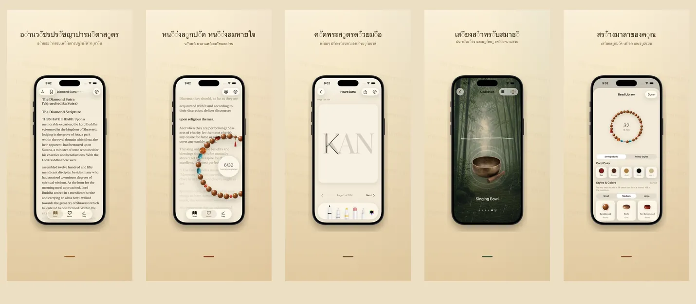

<p align="center">
  
</p>

<h1 align="center">Rushi 如是</h1>

<p align="center">
  <strong>หนึ่งเม็ด หนึ่งลมหายใจ ปัจจุบันขณะ</strong>
  <br>
  พระสูตรเพชร &amp; พระสูตรหฤทัย · 17 ภาษา · 100% บนอุปกรณ์
  <br>
  <a href="https://hooosberg.github.io/Rushi/">🌐 เว็บไซต์ทางการ</a>
</p>

<p align="center">
  <a href="../README.md">English</a> |
  <a href="README_zh-Hans.md">简体中文</a> |
  <a href="README_zh-Hant.md">繁體中文</a> |
  <a href="README_ja.md">日本語</a> |
  <a href="README_ko.md">한국어</a> |
  <a href="README_vi.md">Tiếng Việt</a> |
  <a href="README_de.md">Deutsch</a> |
  <a href="README_fr.md">Français</a> |
  <a href="README_th.md">ไทย</a>
</p>

<p align="center">
  <a href="../LICENSE"></a>
  
  
  <br>
  
  
  
</p>

<p align="center">
  <a href="https://hooosberg.github.io/Rushi/">
    
  </a>
</p>

> 🚧 **App Store: เร็ว ๆ นี้** คัมภีร์ต้นฉบับเปิดเผยแล้วในโฟลเดอร์ `scriptures/`

**Rushi (如是)** คือแอปสำหรับ iPhone และ iPad ที่เงียบสงบ สำหรับการสวดพระสูตรเพชรและพระสูตรหฤทัย ประคำ 108 เม็ด การคัดพระสูตร และเสียงสมาธิ ทุกอย่างอยู่ในอุปกรณ์ของคุณ — ไม่มีบัญชี ไม่มีการวิเคราะห์ ไม่มีการติดตามจากภายนอก

ชื่อแอป **如是** (*tathatā*, "ความเป็นเช่นนั้น") มาจากคำเปิดของพระสูตรเพชร: **如是我聞** — *"เอวมฺเม สุตํ"* (ข้าพเจ้าได้สดับมาแล้วอย่างนี้) เป็นท่าทีที่แอปต้องการแสดง: อ่านสิ่งที่อยู่ตรงหน้า นับสิ่งที่อยู่ในมือ หายใจในที่ที่อยู่

---

## 🌟 ปรัชญาการออกแบบ

- **เงียบสงบโดยการออกแบบ** — ไม่มีสตรีก ไม่มีตรา ไม่มีการเตือน แต่ละฟังก์ชันถูกออกแบบสำหรับการปฏิบัติที่สมบูรณ์ครั้งเดียว
- **ซื่อสัตย์ต่อต้นฉบับ** — แต่ละย่อหน้าระบุผู้แปล ฉบับต้นทาง วันที่ และที่มาของลิขสิทธิ์ พระสูตรเพชรมีคำแปลจีนทั้งของกุมารชีวะและเสวียนจั้ง สำหรับเปรียบเทียบ
- **เป็นท้องถิ่นจริง ๆ** — ไม่มีบัญชี ไม่มีการอัปโหลดไปยังคลาวด์ของเรา ไม่มี SDK วิเคราะห์ การซิงก์ iCloud (ตามใจ) ใช้ฐานข้อมูล CloudKit ส่วนตัวของคุณเอง เข้ารหัสปลายทางถึงปลายทางโดย Apple

---

## ✨ คุณสมบัติ

- 📖 **อ่านพระสูตร** — พระสูตรเพชร (สองคำแปลจีน: กุมารชีวะ ค.ศ. 5 + เสวียนจั้ง ค.ศ. 7) และพระสูตรหฤทัย ในการจัดเรียงแบบเซริฟวิจิตร 17 ภาษา UI, 9 ฉบับแปลพระสูตร แต่ละย่อหน้ามีที่มาครบถ้วน
- 📿 **ประคำ** — เม็ดไม้ หยก โพธิ์ และเงิน เนื้อสัมผัสจริง ร้อยอย่างอิสระแล้วผูกพู่ห้อย แตะเพื่อนับ ครบ 108 เม็ดเป็นหนึ่งการอุทิศ พระสูตรปัจจุบันเลื่อนเงียบ ๆ ที่ฉากหลัง
- 🖋 **คัดพระสูตร** — ตารางช่องสะอาดสำหรับคัดอักษรทีละตัว รองรับสไตลัสและสัมผัส ต้นฉบับจางเป็นแนว ค่อย ๆ คัดแล้วบันทึกเป็นแผ่นเก็บไว้
- 🎵 **เสียงสมาธิ** — มู่ยู่ ขัน ระฆัง กระดิ่ง สายฝน ป่าไผ่ แต่ละลูปต่อเนื่องไร้รอย ซ้อนกันได้อิสระ ไม่ต้องอินเทอร์เน็ต
- 🪷 **อุทิศ · ประวัติ** — จบหนึ่งรอบประคำ บันทึกเจตนาอุทิศได้สั้น ๆ เก็บในเครื่อง จัดตามวันและพระสูตร เห็นได้เฉพาะคุณ
- 🔒 **อยู่ในเครื่องเท่านั้น** — ไม่ลงทะเบียน ไม่ส่งเข้าคลาวด์ของเรา ไม่มีการวิเคราะห์ ฉลากความเป็นส่วนตัว App Store: **"Data Not Collected"**

---

## 📜 คัมภีร์โอเพนซอร์ส

ทุกข้อความในแอปมาจากฉบับต้นในสาธารณสมบัติที่ตรวจสอบแล้ว คอร์ปัส Markdown ที่จัดเรียบร้อยถูกเผยแพร่ที่นี่ภายใต้ [**CC0 1.0 สาธารณสมบัติ**](https://creativecommons.org/publicdomain/zero/1.0/)

| คัมภีร์ | ฉบับ | ภาษา | โฟลเดอร์ |
|---------|------|------|----------|
| พระสูตรหฤทัย · Heart Sutra | 1 ฉบับสั้น | 11 ภาษา | [`scriptures/xin-jing/`](../scriptures/xin-jing/) |
| พระสูตรเพชร · Diamond Sutra | 13 ฉบับ (กุมารชีวะ + เสวียนจั้ง คำแปลจีน, Goddard 1932 อังกฤษ, Walleser 1914 เยอรมัน, คำแปลทิเบตศตวรรษ 9, NDL 1935 ญี่ปุ่น, 백용성 1922 เกาหลี ฯลฯ) | 13 ฉบับ | [`scriptures/jingang-jing/`](../scriptures/jingang-jing/) |

แต่ละไฟล์ Markdown ระบุที่หัว YAML:

- ผู้แปลและปี
- ชื่อฉบับต้นทางและ URL
- เหตุผลของสาธารณสมบัติ (เป็นรายเขตอำนาจถ้าเกี่ยวข้อง)
- สถานะการตรวจ (`final` / `verified` / `ai-cross-reviewed`)
- หมายเหตุการตรวจ

ใช้สำหรับวิจัย การสอน อ่านเปรียบเทียบ หรือเป็นพื้นฐานของแอปของคุณ — ไม่ต้องระบุเครดิต (แต่ยินดี)

---

## 🔒 ความเป็นส่วนตัวโดยสรุป

| | |
|---|---|
| ข้อมูลส่วนบุคคล | ไม่เก็บ |
| SDK วิเคราะห์ | ไม่มี |
| การติดตามจากบุคคลที่สาม | ไม่มี |
| คำขอเครือข่าย | ไม่มี (แอปทั้งหมดออฟไลน์) |
| การขออนุญาต | การแจ้งเตือน (เฉพาะเมื่อคุณเปิดการเตือนสวด) |
| ที่จัดเก็บข้อมูล | App sandbox + iCloud ส่วนตัวของคุณ (ตามใจ) |
| ฉลาก Apple | **Data Not Collected** |

ข้อความเต็ม: [**Privacy Policy**](https://hooosberg.github.io/Rushi/privacy.html) · [**Terms of Service**](https://hooosberg.github.io/Rushi/terms.html)

---

## 🔤 ฟอนต์ที่มาด้วย

แอปรวมชุดย่อยกลีฟของ [**Noto Serif CJK SC / TC**](https://github.com/notofonts/noto-cjk) เพื่อให้อักษรจีนแบบเซริฟแสดงผลได้แม้บน iOS Simulator ที่ไม่มี Songti / PingFang ฟอนต์อยู่ภายใต้สัญญา [SIL OFL 1.1](https://scripts.sil.org/OFL); ไฟล์ OFL LICENSE มาพร้อมกับ app bundle

---

## 🗂 โครงสร้างคลัง

```
.
├── index.html              หน้าแรก (GitHub Pages)
├── privacy.html            นโยบายความเป็นส่วนตัว (อังกฤษ ฉบับทางการ)
├── terms.html              ข้อกำหนดการให้บริการ (อังกฤษ ฉบับทางการ)
├── i18n.js                 i18n ของเว็บ + ตัวเลือกภาษา
├── styles.css              สไตล์ของเว็บ
├── icons/                  ไอคอนแอป (1024 ต้นแบบ + 8 ขนาด)
├── posters/                ภาพโปรโมต App Store ใน 9 ภาษา
├── scriptures/
│   ├── xin-jing/           พระสูตรหฤทัย (11 ภาษา CC0)
│   └── jingang-jing/       พระสูตรเพชร (13 ฉบับ CC0)
└── i18n/                   คำแปลของ README นี้
```

---

## 🛠 หมายเหตุทางเทคนิค

แอป iOS สร้างด้วย Swift 5 / SwiftUI บน iOS 17 จัดเก็บภายในด้วย SwiftData; การจัดเรียงพระสูตรใช้ CoreText (พร้อม fallback ฟอนต์เซริฟจีนที่หลีกเลี่ยงบั๊ก iOS 17 ของ `UIFont(name:)` ผ่าน `CTFontCreateWithName`); CoreMotion สำหรับฟิสิกส์การแกว่งของจี้; CloudKit สำหรับการซิงก์ iCloud ส่วนตัวที่เป็นทางเลือก ซอร์สโค้ด Swift ยังไม่เป็นโอเพนซอร์ส; คลังนี้มีเฉพาะเว็บไซต์สาธารณะและคอร์ปัสคัมภีร์

---

## 🌐 โปรเจกต์พี่น้อง

โดย [hooosberg](https://github.com/hooosberg):

- [WitNote](https://hooosberg.github.io/WitNote/) — เพื่อนเขียน AI ที่เน้นการทำงานในเครื่อง
- [AgentLimb](https://agentlimb.com) — สอน AI ควบคุมเบราว์เซอร์
- [BeRaw](https://hooosberg.github.io/BeRaw/) — ดึงภาพต้นฉบับจาก Behance
- [Packpour](https://hooosberg.github.io/Packpour/) — กรอกภาษา App Store Connect ทีละจำนวนมาก
- [GlotShot](https://hooosberg.github.io/GlotShot/) — ภาพตัวอย่าง App Store ที่สมบูรณ์แบบ
- [TrekReel](https://hooosberg.github.io/TrekReel/) — เส้นทางกลางแจ้ง รีลแบบภาพยนตร์
- [DOMPrompter](https://hooosberg.github.io/DOMPrompter/) — แสดงภาพ DOM สำหรับการเขียนโค้ดด้วย AI
- [UIXskills](https://uixskills.com) — AI → JSON → ไวท์บอร์ด → UI

---

## 👨‍💻 ผู้พัฒนา

**hooosberg**

📧 [zikedece@proton.me](mailto:zikedece@proton.me)

🔗 [https://github.com/hooosberg/Rushi](https://github.com/hooosberg/Rushi)

🐛 พบคำผิดหรือฉบับต้นที่ดีกว่าหรือเปล่า? โปรดเปิด [issue](https://github.com/hooosberg/Rushi/issues) หรือ PR

---

<p align="center">
  <i>หนึ่งเม็ด หนึ่งลมหายใจ ปัจจุบันขณะ<br>如是我聞</i>
</p>
