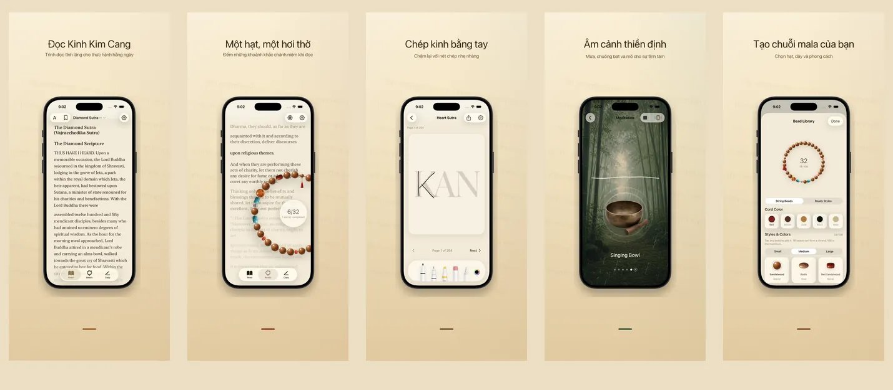

<p align="center">
  
</p>

<h1 align="center">如是 Rushi</h1>

<p align="center">
  <strong>Một hạt, một hơi thở, hiện tiền</strong>
  <br>
  Kinh Kim Cang &amp; Tâm Kinh · 17 ngôn ngữ · 100% trên thiết bị
  <br>
  <a href="https://hooosberg.github.io/Rushi/">🌐 Trang chủ chính thức</a>
</p>

<p align="center">
  <a href="../README.md">English</a> |
  <a href="README_zh-Hans.md">简体中文</a> |
  <a href="README_zh-Hant.md">繁體中文</a> |
  <a href="README_ja.md">日本語</a> |
  <a href="README_ko.md">한국어</a> |
  <a href="README_vi.md">Tiếng Việt</a> |
  <a href="README_de.md">Deutsch</a> |
  <a href="README_fr.md">Français</a> |
  <a href="README_th.md">ไทย</a>
</p>

<p align="center">
  <a href="../LICENSE"></a>
  
  
  <br>
  
  
  
</p>

<p align="center">
  <a href="https://hooosberg.github.io/Rushi/">
    
  </a>
</p>

> 🚧 **App Store: sắp ra mắt.** Kinh nguồn đã được công khai trong thư mục `scriptures/`.

**如是 (Rushi)** là một ứng dụng tĩnh tâm dành cho iPhone và iPad: tụng đọc Kinh Kim Cang và Tâm Kinh đa ngôn ngữ, tràng hạt 108 hạt, chép kinh và âm thanh thiền. Tất cả dữ liệu lưu trên thiết bị của bạn — không tài khoản, không phân tích, không theo dõi bên thứ ba.

Tên ứng dụng **如是** (*Như Thị*, "đúng như nó là") lấy từ câu mở đầu Kinh Kim Cang **如是我聞** — *"Như thị ngã văn"*. Đó cũng là tinh thần ứng dụng: đọc chữ trước mắt, đếm hạt trong tay, hít thở nơi mình đang ngồi.

---

## 🌟 Triết lý thiết kế

- **Tĩnh từ trong thiết kế** — không chuỗi ngày liên tục, không huy hiệu, không nhắc nhở. Mỗi tính năng được thiết kế cho một thời tu trọn vẹn.
- **Trung thành với bản nền** — mỗi đoạn ghi rõ dịch giả, niên đại, nguồn và cơ sở bản quyền. Kinh Kim Cang đính kèm cả hai bản Hán dịch của Cưu-ma-la-thập và Huyền Trang để đối chiếu.
- **Thực sự nội bộ** — không tài khoản, không tải lên đám mây cho chúng tôi, không SDK phân tích. Đồng bộ iCloud (tùy chọn) dùng cơ sở dữ liệu CloudKit riêng tư của bạn, được Apple mã hóa đầu cuối.

---

## ✨ Tính năng

- 📖 **Đọc kinh** — Kinh Kim Cang (hai bản Hán dịch của Cưu-ma-la-thập thế kỷ 5 và Huyền Trang thế kỷ 7) và Tâm Kinh, dàn trang chữ thư pháp. 17 ngôn ngữ giao diện, 9 bản dịch kinh, mỗi đoạn đều có xuất xứ đầy đủ.
- 📿 **Tràng hạt** — Hạt gỗ, ngọc, bồ-đề, bạc với chất cảm thật. Tự xâu hạt và kết móc treo. Chạm để đếm; 108 hạt là một vòng hồi hướng. Đoạn kinh hiện đọc trôi nhẹ ở phía sau.
- 🖋 **Chép kinh** — Khung chép kinh ô vuông gọn gàng, hỗ trợ bút và cảm ứng. Nguyên văn hiện mờ làm hướng dẫn; chép từng chữ rồi lưu lại tờ giấy.
- 🎵 **Âm cảnh thiền** — Mộc ngư, khánh, chuông, chuông gió, mưa, rừng tre. Mỗi âm cảnh tuần hoàn liền mạch, có thể chồng lớp. Không cần mạng.
- 🪷 **Hồi hướng · Lịch sử** — Sau mỗi vòng tràng hạt, ghi lại tâm nguyện hồi hướng. Lưu trên máy, sắp theo ngày và kinh, chỉ mình bạn thấy.
- 🔒 **Hoàn toàn nội bộ** — Không đăng ký, không gửi đám mây cho chúng tôi, không phân tích. Nhãn riêng tư App Store: **"Data Not Collected"**.

---

## 📜 Kinh nguồn mã nguồn mở

Mỗi đoạn kinh trong app đều từ bản nền thuộc phạm vi công cộng đã xác minh. Kho Markdown đã chỉnh được công bố tại đây với giấy phép [**CC0 1.0 Phạm vi công cộng**](https://creativecommons.org/publicdomain/zero/1.0/).

| Kinh | Phiên bản | Ngôn ngữ | Thư mục |
|------|-----------|----------|---------|
| Tâm Kinh · Heart Sutra | 1 bản ngắn | 11 ngôn ngữ | [`scriptures/xin-jing/`](../scriptures/xin-jing/) |
| Kim Cang · Diamond Sutra | 13 bản (Cưu-ma-la-thập + Huyền Trang Hán dịch, Goddard 1932 Anh, Walleser 1914 Đức, Tạng dịch thế kỷ 9, NDL 1935 Nhật, 백용성 1922 Hàn, v.v.) | 13 bản | [`scriptures/jingang-jing/`](../scriptures/jingang-jing/) |

Mỗi tệp Markdown đều ghi rõ ở đầu YAML:

- dịch giả và niên đại
- tên bản nền và URL nguồn
- cơ sở bản quyền (theo từng khu vực pháp lý nếu cần)
- trạng thái biên tập (`final` / `verified` / `ai-cross-reviewed`)
- ghi chú biên tập

Dùng cho nghiên cứu, giảng dạy, đối chiếu, hoặc làm nền cho ứng dụng của bạn — không yêu cầu ghi nhận (nhưng được hoan nghênh).

---

## 🔒 Quyền riêng tư tóm lược

| | |
|---|---|
| Thông tin cá nhân | Không thu thập |
| SDK phân tích | Không |
| Theo dõi bên thứ ba | Không |
| Yêu cầu mạng | Không (app hoàn toàn ngoại tuyến) |
| Quyền yêu cầu | Thông báo (chỉ khi bạn bật nhắc nhở tụng đọc) |
| Lưu trữ | App sandbox + iCloud riêng của bạn (tùy chọn) |
| Nhãn riêng tư Apple | **Data Not Collected** |

Văn bản đầy đủ: [**Privacy Policy**](https://hooosberg.github.io/Rushi/privacy.html) · [**Terms of Service**](https://hooosberg.github.io/Rushi/terms.html)

---

## 🔤 Phông kèm theo

App đính kèm tập glyph con của [**Noto Serif CJK SC / TC**](https://github.com/notofonts/noto-cjk) để chữ Hán có chân vẫn hiển thị đúng trên các bản iOS Simulator đã loại bỏ Songti / PingFang. Phông được cấp phép theo [SIL OFL 1.1](https://scripts.sil.org/OFL); tệp OFL LICENSE đi kèm trong app bundle.

---

## 🗂 Cấu trúc kho

```
.
├── index.html              trang chủ (GitHub Pages)
├── privacy.html            chính sách quyền riêng tư (tiếng Anh, bản gốc)
├── terms.html              điều khoản dịch vụ (tiếng Anh, bản gốc)
├── i18n.js                 i18n trang web + chọn ngôn ngữ
├── styles.css              kiểu trang web
├── icons/                  biểu tượng app (1024 chính + 8 kích thước)
├── posters/                ảnh quảng bá App Store cho 9 ngôn ngữ
├── scriptures/
│   ├── xin-jing/           Tâm Kinh (11 ngôn ngữ, CC0)
│   └── jingang-jing/       Kim Cang (13 bản, CC0)
└── i18n/                   bản dịch của README này
```

---

## 🛠 Ghi chú kỹ thuật

App iOS dựng bằng Swift 5 / SwiftUI trên iOS 17. Lưu trữ nội bộ dùng SwiftData; dàn chữ kinh dùng CoreText (tự cài fallback chữ Hán có chân để vượt qua lỗi `UIFont(name:)` của iOS 17, qua `CTFontCreateWithName`); cảm giác đung đưa của móc treo dùng CoreMotion; đồng bộ iCloud riêng tư (tùy chọn) dùng CloudKit. Mã nguồn Swift hiện chưa mở; kho này chỉ chứa trang web công khai và bộ kinh.

---

## 🌐 Dự án cùng tác giả

Của [hooosberg](https://github.com/hooosberg):

- [WitNote](https://hooosberg.github.io/WitNote/) — bạn đồng hành viết AI ưu tiên cục bộ
- [AgentLimb](https://agentlimb.com) — dạy AI điều khiển trình duyệt
- [BeRaw](https://hooosberg.github.io/BeRaw/) — lấy ảnh gốc Behance
- [Packpour](https://hooosberg.github.io/Packpour/) — điền hàng loạt ngôn ngữ App Store Connect
- [GlotShot](https://hooosberg.github.io/GlotShot/) — ảnh xem trước App Store hoàn hảo
- [TrekReel](https://hooosberg.github.io/TrekReel/) — đường mòn ngoài trời, video điện ảnh
- [DOMPrompter](https://hooosberg.github.io/DOMPrompter/) — trực quan hóa DOM cho AI viết code
- [UIXskills](https://uixskills.com) — AI → JSON → bảng trắng → UI

---

## 👨‍💻 Tác giả

**hooosberg**

📧 [zikedece@proton.me](mailto:zikedece@proton.me)

🔗 [https://github.com/hooosberg/Rushi](https://github.com/hooosberg/Rushi)

🐛 Phát hiện lỗi chữ hoặc bản nền tốt hơn? Vui lòng mở [issue](https://github.com/hooosberg/Rushi/issues) hoặc PR.

---

<p align="center">
  <i>Một hạt, một hơi thở, hiện tiền<br>如是我聞</i>
</p>
