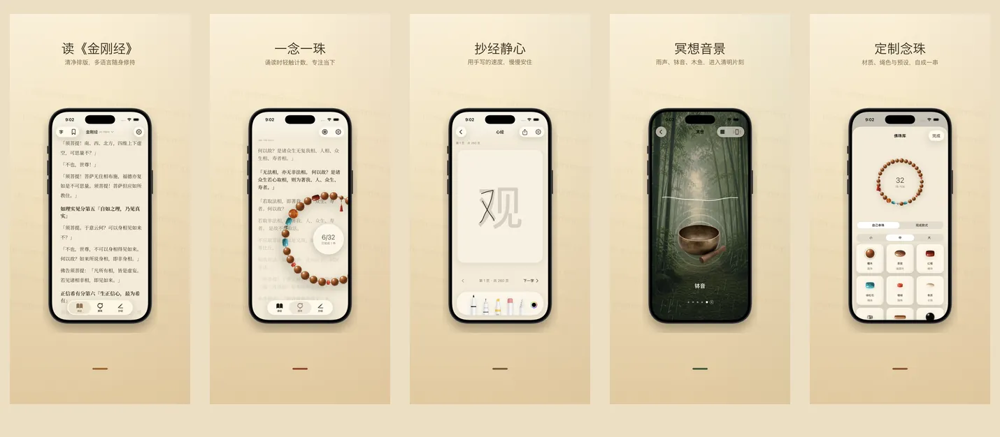

<p align="center">
  
</p>

<h1 align="center">如是 Rushi</h1>

<p align="center">
  <strong>一念一珠，安住当下</strong>
  <br>
  金刚经 &amp; 心经 · 17 种语言 · 100% 设备本地
  <br>
  <a href="https://hooosberg.github.io/Rushi/">🌐 官方网站</a>
</p>

<p align="center">
  <a href="../README.md">English</a> |
  <a href="README_zh-Hans.md">简体中文</a> |
  <a href="README_zh-Hant.md">繁體中文</a> |
  <a href="README_ja.md">日本語</a> |
  <a href="README_ko.md">한국어</a> |
  <a href="README_vi.md">Tiếng Việt</a> |
  <a href="README_de.md">Deutsch</a> |
  <a href="README_fr.md">Français</a> |
  <a href="README_th.md">ไทย</a>
</p>

<p align="center">
  <a href="../LICENSE"></a>
  
  
  <br>
  
  
  
</p>

<p align="center">
  <a href="https://hooosberg.github.io/Rushi/">
    
  </a>
</p>

> 🚧 **App Store 即将上架。** 源经文已在 `scriptures/` 目录公开。

**如是（Rushi）** 是一款 iPhone 与 iPad 上的清净修持应用：金刚经与心经的多语种诵读、108 颗念珠、抄经面板、冥想音景。所有数据保存在你的设备里——无账号，无分析，无第三方追踪。

应用名 **如是**（*Tathatā*，"事物本来的样子"）取自《金刚经》开篇 **如是我闻**。这也是 app 想呈现的姿态：读眼前的字，数手中的珠，呼吸所在之处的气。

---

## 🌟 设计原则

- **安静设计** —— 没有连续打卡，没有徽章，没有提醒催促。每个功能都围绕"一次完整的修持"而设计。
- **忠实底本** —— 每段经文都标注译者、底本年代、出处与版权来源。金刚经同时收录鸠摩罗什与玄奘两种汉译，便于对读。
- **真正本地** —— 没有账号，没有云端上传，没有分析 SDK。可选 iCloud 同步使用你自己的私人 CloudKit 数据库，由 Apple 端到端加密。

---

## ✨ 功能

- 📖 **读经** —— 金刚经（鸠摩罗什 5 世纪 + 玄奘 7 世纪两种汉译）与心经，呈现于书法衬线排版。17 种界面语言、9 种经文译本，每段都有完整出处。
- 📿 **念珠** —— 真实质感的木珠 / 玉珠 / 菩提子 / 银饰，可自由穿珠搭配挂饰。点击计数，108 颗一回向；背景同步显示当前所读经文段落。
- 🖋 **抄经** —— 一字一格的清净抄经面板，支持手写笔与触屏。原文以淡字为底，依次描红，完成后可保存为念。
- 🎵 **冥想音景** —— 木鱼、磬、钟、铃铛、雨、竹林。每段循环自然衔接，可叠加。无需联网。
- 🪷 **回向 · 历史** —— 每完成一回念珠，写下当下的回向意图。保存于设备本地，按时间和经文分类，私密只见于你。
- 🔒 **纯本地** —— 没有注册，没有云端，没有分析。Apple App Store 隐私标签：**"Data Not Collected"（不收集任何数据）**。

---

## 📜 开源经文

应用内每一段经文都来自经过验证的公有领域底本。整理后的 Markdown 版本以 [**CC0 1.0 公有领域**](https://creativecommons.org/publicdomain/zero/1.0/) 协议在此公开。

| 经文 | 版本 | 语言 | 目录 |
|------|------|------|------|
| 心经 · Heart Sutra | 1 个短本 | 11 种语言 | [`scriptures/xin-jing/`](../scriptures/xin-jing/) |
| 金刚经 · Diamond Sutra | 13 个版本（鸠摩罗什+玄奘汉译、Goddard 1932 英译、Walleser 1914 德译、9 世纪藏译、1935 NDL 日译、1922 백용성 韩译等）| 13 个版本 | [`scriptures/jingang-jing/`](../scriptures/jingang-jing/) |

每个 Markdown 文件的 YAML 头部都标注：

- 译者与年代
- 底本名称和出处 URL
- 版权依据（必要时按司法辖区分别说明）
- 编辑状态（`final` / `verified` / `ai-cross-reviewed`）
- 编辑说明

可用于研究、教学、对读，或作为你自己 app 的起点——无需署名（但欢迎）。

---

## 🔒 隐私一览

| | |
|---|---|
| 个人信息 | 不收集 |
| 分析 SDK | 无 |
| 第三方追踪 | 无 |
| 网络请求 | 无（整个 app 离线） |
| 权限请求 | 通知（仅在你主动开启诵读提醒时） |
| 数据存储 | app sandbox + 你的私人 iCloud（可选） |
| Apple 隐私标签 | **Data Not Collected** |

完整文本：[**Privacy Policy**](https://hooosberg.github.io/Rushi/privacy.html) · [**Terms of Service**](https://hooosberg.github.io/Rushi/terms.html)

---

## 🔤 字体

应用捆绑 [**Noto Serif CJK SC / TC**](https://github.com/notofonts/noto-cjk) 子集，确保即使在剥离了 Songti / PingFang 的 iOS 模拟器上中文衬线也能完整呈现。字体使用 [SIL OFL 1.1](https://scripts.sil.org/OFL) 协议；OFL LICENSE 文件随 app bundle 一同分发。

---

## 🗂 仓库结构

```
.
├── index.html              落地页（GitHub Pages）
├── privacy.html            隐私政策（英文，权威版本）
├── terms.html              服务条款（英文，权威版本）
├── i18n.js                 站点 i18n + 语言选择
├── styles.css              站点样式
├── icons/                  app 图标（1024 主图 + 8 个尺寸）
├── posters/                9 种语言的 App Store 宣传图
├── scriptures/
│   ├── xin-jing/           心经（11 种语言，CC0）
│   └── jingang-jing/       金刚经（13 个版本，CC0）
└── i18n/                   本 README 的翻译版本
```

---

## 🛠 技术说明

iOS app 使用 Swift 5 / SwiftUI 在 iOS 17 上构建：本地存储用 SwiftData；经文排版用 CoreText（自行实现绕过 iOS 17 `UIFont(name:)` bug 的中文衬线 fallback，通过 `CTFontCreateWithName`）；挂饰摆动手感用 CoreMotion；可选私人 iCloud 同步用 CloudKit。Swift 源代码暂未开源；本仓库仅包含落地页和经文。

---

## 🌐 同系列项目

[hooosberg](https://github.com/hooosberg) 出品：

- [WitNote](https://hooosberg.github.io/WitNote/) —— 本地优先的 AI 写作搭档
- [AgentLimb](https://agentlimb.com) —— 教 AI 操作你的浏览器
- [BeRaw](https://hooosberg.github.io/BeRaw/) —— Behance 原图抓取
- [Packpour](https://hooosberg.github.io/Packpour/) —— App Store Connect 多语言批量填表
- [GlotShot](https://hooosberg.github.io/GlotShot/) —— 完美 App Store 预览图
- [TrekReel](https://hooosberg.github.io/TrekReel/) —— 户外步道电影感短片
- [DOMPrompter](https://hooosberg.github.io/DOMPrompter/) —— 可视化 DOM 给 AI 写代码
- [UIXskills](https://uixskills.com) —— AI → JSON → 白板 → UI

---

## 👨‍💻 作者

**hooosberg**

📧 [zikedece@proton.me](mailto:zikedece@proton.me)

🔗 [https://github.com/hooosberg/Rushi](https://github.com/hooosberg/Rushi)

🐛 发现错字或更佳底本？欢迎开 [issue](https://github.com/hooosberg/Rushi/issues) 或 PR。

---

<p align="center">
  <i>一念一珠，安住当下<br>如是我闻</i>
</p>
