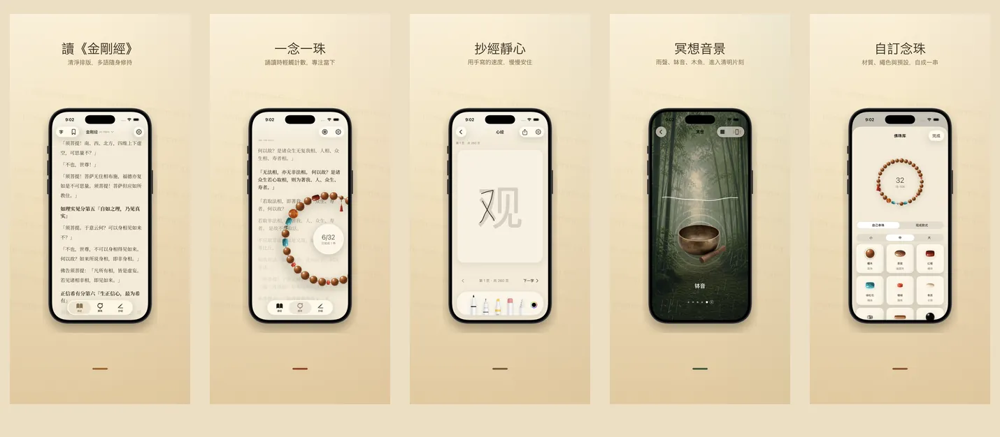

<p align="center">
  
</p>

<h1 align="center">如是 Rushi</h1>

<p align="center">
  <strong>一念一珠，安住當下</strong>
  <br>
  金剛經 &amp; 心經 · 17 種語言 · 100% 裝置本地
  <br>
  <a href="https://hooosberg.github.io/Rushi/">🌐 官方網站</a>
</p>

<p align="center">
  <a href="../README.md">English</a> |
  <a href="README_zh-Hans.md">简体中文</a> |
  <a href="README_zh-Hant.md">繁體中文</a> |
  <a href="README_ja.md">日本語</a> |
  <a href="README_ko.md">한국어</a> |
  <a href="README_vi.md">Tiếng Việt</a> |
  <a href="README_de.md">Deutsch</a> |
  <a href="README_fr.md">Français</a> |
  <a href="README_th.md">ไทย</a>
</p>

<p align="center">
  <a href="../LICENSE"></a>
  
  
  <br>
  
  
  
</p>

<p align="center">
  <a href="https://hooosberg.github.io/Rushi/">
    
  </a>
</p>

> 🚧 **App Store 即將上架。** 源經文已在 `scriptures/` 目錄公開。

**如是（Rushi）** 是一款 iPhone 與 iPad 上的清淨修持應用：金剛經與心經的多語種誦讀、108 顆念珠、抄經面板、冥想音景。所有資料保存在你的裝置裡——無帳號，無分析，無第三方追蹤。

應用名 **如是**（*Tathatā*，「事物本來的樣子」）取自《金剛經》開篇 **如是我聞**。也是 app 想呈現的姿態：讀眼前的字，數手中的珠，呼吸所在之處的氣。

---

## 🌟 設計原則

- **安靜設計** —— 沒有連續打卡、沒有徽章、沒有提醒催促。每個功能都圍繞「一次完整的修持」而設計。
- **忠實底本** —— 每段經文都標註譯者、底本年代、出處與版權來源。金剛經同時收錄鳩摩羅什與玄奘兩種漢譯，方便對讀。
- **真正本地** —— 無帳號、無雲端上傳、無分析 SDK。目前版本所有資料都僅保存在 app sandbox 中；解除安裝即清除全部資料。

---

## ✨ 功能

- 📖 **讀經** —— 金剛經（鳩摩羅什 5 世紀 + 玄奘 7 世紀兩種漢譯）與心經，呈現於書法襯線排版。17 種介面語言、9 種經文譯本，每段都有完整出處。
- 📿 **念珠** —— 真實質感的木珠 / 玉珠 / 菩提子 / 銀飾，可自由穿珠搭配掛飾。點擊計數，108 顆一回向；背景同步顯示當前所讀經文段落。
- 🖋 **抄經** —— 一字一格的清淨抄經面板，支援手寫筆與觸控。原文以淡字為底，依次描紅，完成後可保存為念。
- 🎵 **冥想音景** —— 木魚、磬、鐘、鈴鐺、雨、竹林。每段循環自然銜接，可疊加。無需連網。
- 🪷 **回向 · 歷史** —— 每完成一回念珠，寫下當下的回向意圖。保存於裝置本地，按時間和經文分類，私密只見於你。
- 🔒 **純本地** —— 無註冊、無雲端、無分析。Apple App Store 隱私標籤：**「Data Not Collected」（不收集任何資料）**。

---

## 📜 開源經文

應用內每一段經文都來自經過驗證的公有領域底本。整理後的 Markdown 版本以 [**CC0 1.0 公有領域**](https://creativecommons.org/publicdomain/zero/1.0/) 授權在此公開。

| 經文 | 版本 | 語言 | 目錄 |
|------|------|------|------|
| 心經 · Heart Sutra | 1 個短本 | 11 種語言 | [`scriptures/xin-jing/`](../scriptures/xin-jing/) |
| 金剛經 · Diamond Sutra | 13 個版本（鳩摩羅什+玄奘漢譯、Goddard 1932 英譯、Walleser 1914 德譯、9 世紀藏譯、1935 NDL 日譯、1922 백용성 韓譯等）| 13 個版本 | [`scriptures/jingang-jing/`](../scriptures/jingang-jing/) |

每個 Markdown 檔案的 YAML 頭部都標註：

- 譯者與年代
- 底本名稱和出處 URL
- 版權依據（必要時按司法轄區分別說明）
- 編輯狀態（`final` / `verified` / `ai-cross-reviewed`）
- 編輯說明

可用於研究、教學、對讀，或作為你自己 app 的起點——無需署名（但歡迎）。

---

## 🔒 隱私一覽

| | |
|---|---|
| 個人資訊 | 不收集 |
| 分析 SDK | 無 |
| 第三方追蹤 | 無 |
| 網路請求 | 無（整個 app 離線） |
| 權限請求 | 通知（僅在你主動開啟誦讀提醒時） |
| 資料儲存 | 僅 app sandbox（解除安裝即清除） |
| Apple 隱私標籤 | **Data Not Collected** |

完整文本：[**Privacy Policy**](https://hooosberg.github.io/Rushi/privacy.html) · [**Terms of Service**](https://hooosberg.github.io/Rushi/terms.html)

---

## 🔤 字體

應用捆綁 [**Noto Serif CJK SC / TC**](https://github.com/notofonts/noto-cjk) 子集，確保即使在剝離了 Songti / PingFang 的 iOS 模擬器上中文襯線也能完整呈現。字體使用 [SIL OFL 1.1](https://scripts.sil.org/OFL) 授權；OFL LICENSE 檔案隨 app bundle 一同分發。

---

## 🗂 倉庫結構

```
.
├── index.html              落地頁（GitHub Pages）
├── privacy.html            隱私政策（英文，權威版本）
├── terms.html              服務條款（英文，權威版本）
├── i18n.js                 站點 i18n + 語言選擇
├── styles.css              站點樣式
├── icons/                  app 圖示（1024 主圖 + 8 個尺寸）
├── posters/                9 種語言的 App Store 宣傳圖
├── scriptures/
│   ├── xin-jing/           心經（11 種語言，CC0）
│   └── jingang-jing/       金剛經（13 個版本，CC0）
└── i18n/                   本 README 的翻譯版本
```

---

## 🛠 技術說明

iOS app 使用 Swift 5 / SwiftUI 在 iOS 17 上建構：本地儲存用 SwiftData；經文排版用 CoreText（自行實作繞過 iOS 17 `UIFont(name:)` bug 的中文襯線 fallback，透過 `CTFontCreateWithName`）；掛飾擺動手感用 CoreMotion。Swift 原始碼暫未開源；本倉庫僅包含落地頁和經文。

---

## 🌐 同系列專案

[hooosberg](https://github.com/hooosberg) 出品：

- [WitNote](https://hooosberg.github.io/WitNote/) —— 本地優先的 AI 寫作夥伴
- [AgentLimb](https://agentlimb.com) —— 教 AI 操作你的瀏覽器
- [BeRaw](https://hooosberg.github.io/BeRaw/) —— Behance 原圖擷取
- [Packpour](https://hooosberg.github.io/Packpour/) —— App Store Connect 多語言批次填表
- [GlotShot](https://hooosberg.github.io/GlotShot/) —— 完美 App Store 預覽圖
- [TrekReel](https://hooosberg.github.io/TrekReel/) —— 戶外步道電影感短片
- [DOMPrompter](https://hooosberg.github.io/DOMPrompter/) —— 可視化 DOM 給 AI 寫程式
- [UIXskills](https://uixskills.com) —— AI → JSON → 白板 → UI

---

## 👨‍💻 作者

**hooosberg**

📧 [zikedece@proton.me](mailto:zikedece@proton.me)

🔗 [https://github.com/hooosberg/Rushi](https://github.com/hooosberg/Rushi)

🐛 發現錯字或更佳底本？歡迎開 [issue](https://github.com/hooosberg/Rushi/issues) 或 PR。

---

<p align="center">
  <i>一念一珠，安住當下<br>如是我聞</i>
</p>
